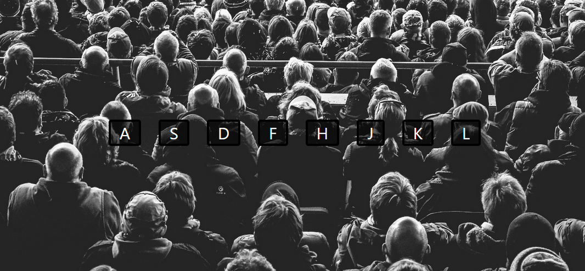

- Live Site : -> [CLICK HERE]()
- Solution Page : -> [CLICK HERE]()
# 🎶 Interactive Drum Kit App Developer | React.js

#### Excited to share a glimpse of my latest project – an interactive drum kit application built with React.js! 🥁✨

## 🌈 Key Features:

-   🎵 Dynamic Sound Effects: Programmed a virtual drum kit with unique sound effects triggered by both keyboard input and button clicks.
  
-   🎹 Modular Design: Developed a modular structure for easy expansion, allowing seamless addition of new drum sounds or buttons.

## How it works:

-    Press keys 'A' to 'L' or click on corresponding buttons to play drum sounds.
-    Enjoy real-time visual feedback with each beat!

## ScreenShot :
